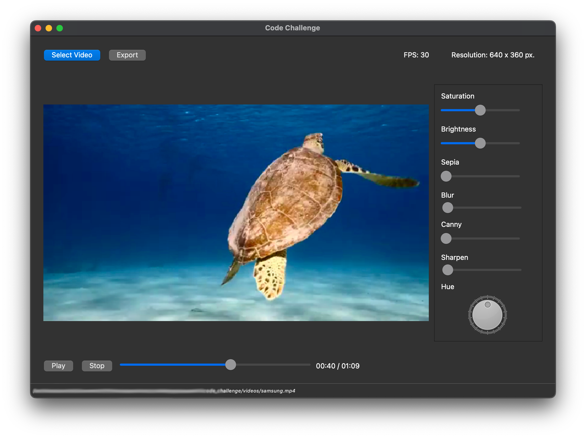
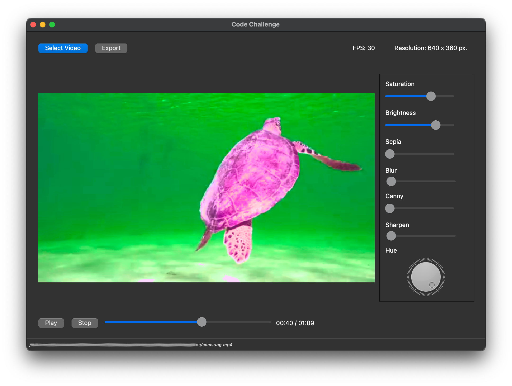
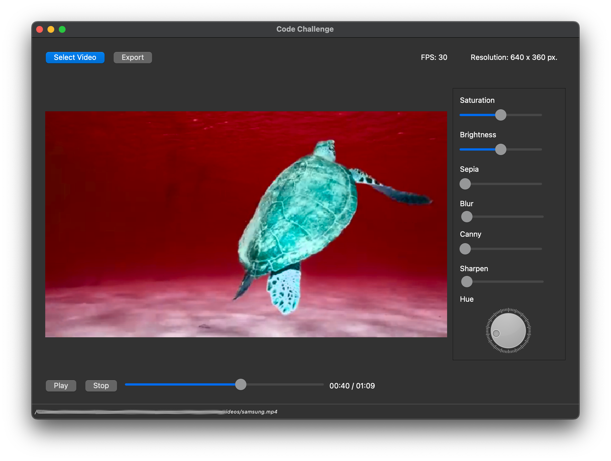

# Filter video editor 

<!---->

<p float="left">
    
     
    
    
</p>

In the following guide you will find a description of how to run the video editor application and its unittest.

## Executing

The application can be run in two different ways. 

The first option is to install Python 3.9, with pip install all the requirements and run the python command directly to start the editor.

The second way is to run a packaged application shipped within the folder. In this case you can run the packaged application without installing a Python interpreter or any modules.

### Executing app with python 3.9

The application was developed with Python 3.9

Clone this code repository:
```
https://github.com/fbzyx/video-editor.git
```
go to **challenge** folder:
```
cd challenge
```

First, in the root directory create and activate a virtual environment:
```
python -m venv venv 
source venv/bin/activate
```
You should now have a virtual environment in a venv folder inside the challenge folder.

Next, install the project requirements:
```
pip install -r requirements.txt 
```
Finally, execute the following command to run the application (from the root folder):
```
python video_editor/run_app.py
```

---
**NOTE**

In the video folder there is a collection of videos so that you can test the application with a set of files (broken files, different formats, etc.).

---

### Executing app packaged

In the /dist folder there are two files, double click on one of them. Both have the name run_app but one runs in terminal and the other is an .app file for mac OS. Note that it may take several seconds to start (I don't know why, but about 30 seconds).
**Since the bundled application was compiled on a mac OS machine with Pyinstaller, the bundled application can only be run on another mac OS machine (with Apple silicon)**.

If your machine doesnt allow app execution due to security concerns:
Go to  System Settings -> click Privacy & Security -> Then scroll down to Security -> Look for the name of this app and allow to execute


## Features

- Import video files in .mp4 .avi .mov formats
- Check the length and size of the frames and if the file can be opened
- Display a dialog box with basic information of the video file or error.
- Filters in the following order: Blur → Canny → Sharpen → Brightness → Saturation → Hue → Sepia.
- Start, stop buttons and video position slider.
- Video export function using multiprocessing.
- Unit test

## Testing

To test the complete application, go to the root folder (challenge) and run the following command in the terminal:
```
python -m unittest discover -s video_editor
```
You can also run the tests from within the application folder (video_editor) as shown below:
```
python -m unittest discover 

```

A single test file can be run as follows (from within the video_editor folder):

```
python -m unittest export.test.test_export
```
This executes the test of test_export.py.

## Resources used

### ChatGPT

I used ChatGPT mainly for creating filters and their tests. 
It is very useful for coding testcases, where the coding for each filter is repetitive.

### PyQt6

A very useful resource is the following: https://www.pythonguis.com/pyqt6-tutorial/

For Qt Designer this was a good tutorial on how to use layouts and containers in the user interface: https://www.youtube.com/watch?v=EmZZvBEKBxc

#### [Done by fbzyx](https://fbzyx.de)